Here are all the samples of themes in OneNote 2016 (Dark Mode). All the samples are for Java Code Snippets.

#### 1. acid:
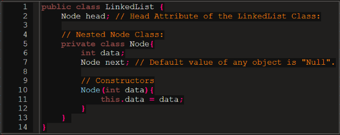
### 2. aiseered:
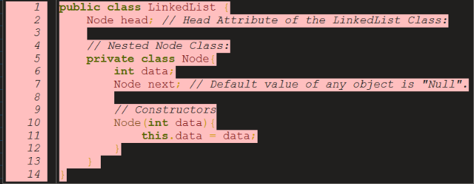
### 3. anotherdark
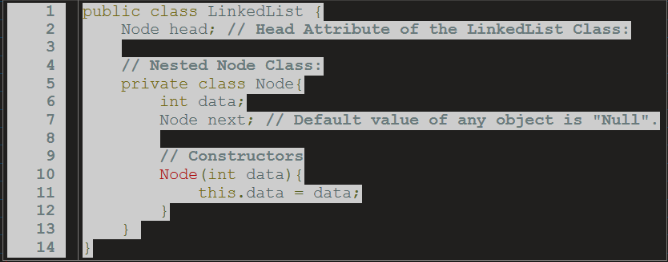
### 4. autumn

### 5. baycomb
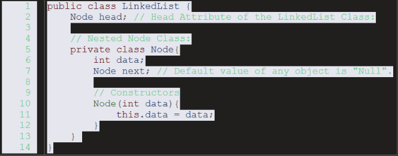
### 6. bclear
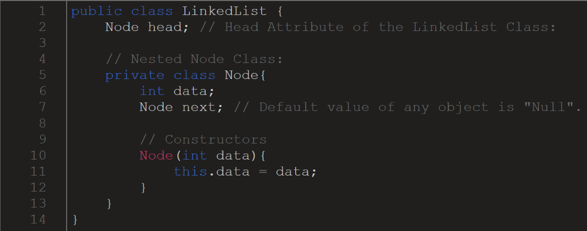
### 7. biogoo
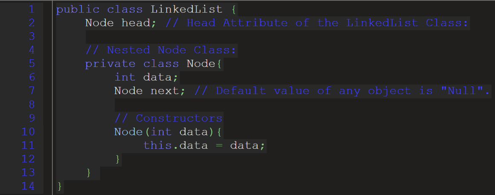
### 8. bipolar
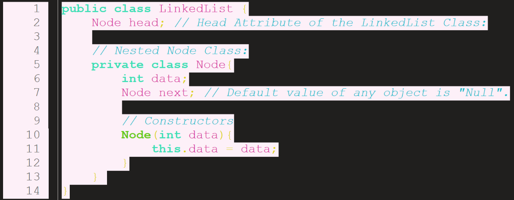
### 9. blacknblue
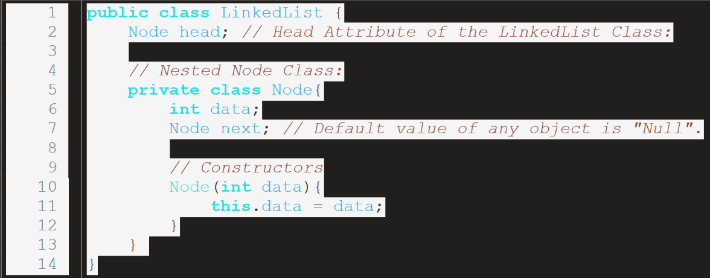
### 10. bluegreen

### 11. breeze
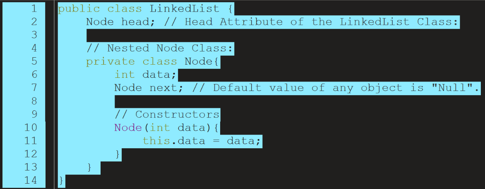
### 12. bright
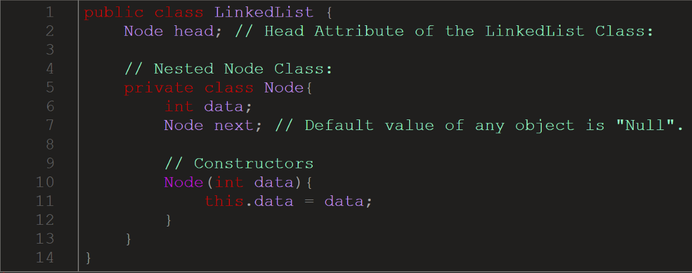
### 13. camo
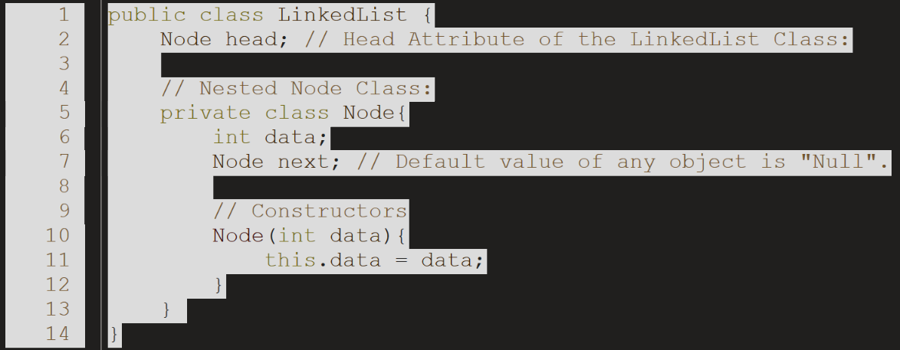
### 14. candy
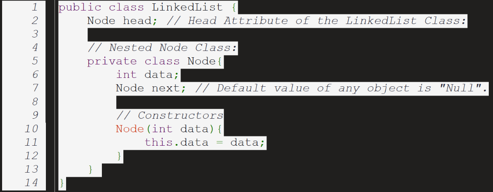
### 15. clarity
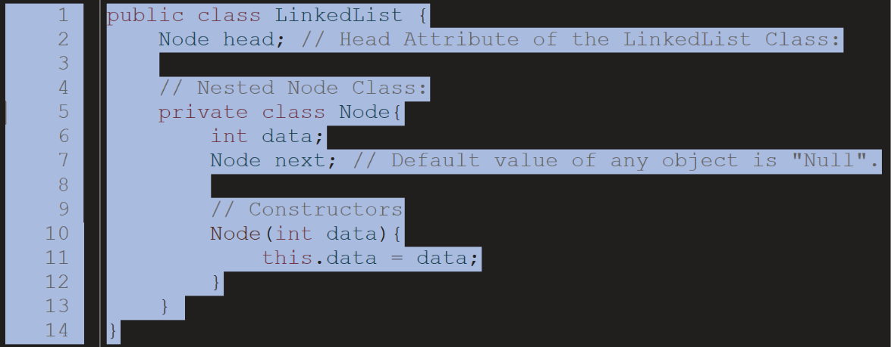
### 16. dante
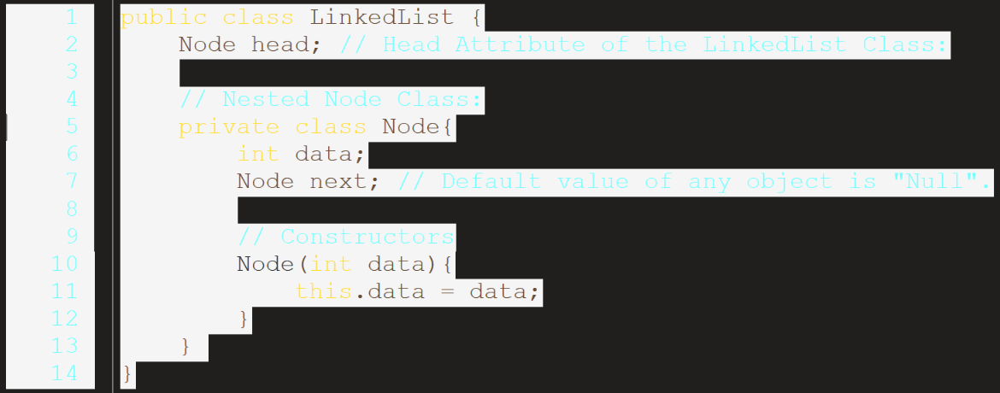
### 17. darkblue
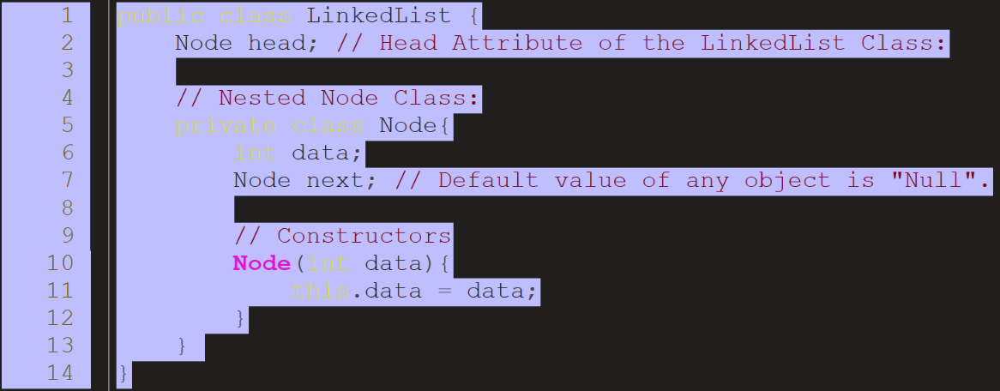
### 18. darkbone
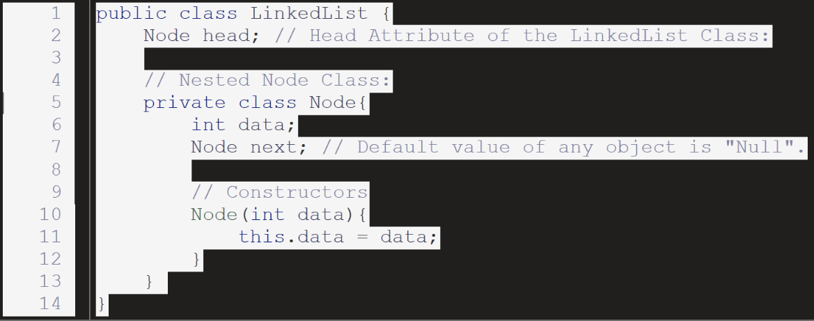
### 19. darkness
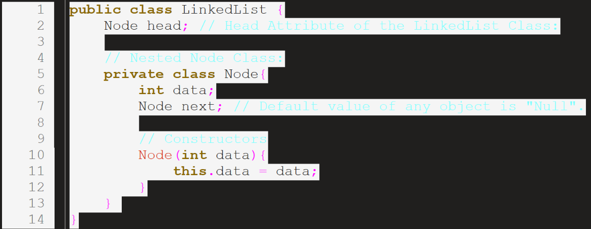
### 20. darkplus
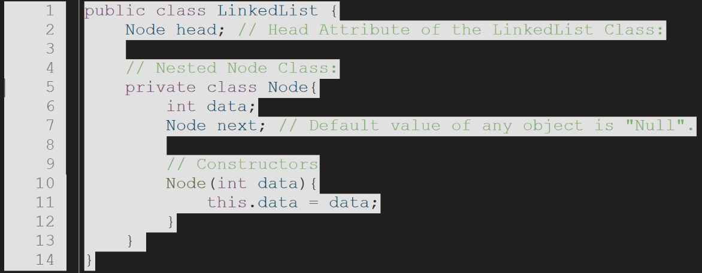